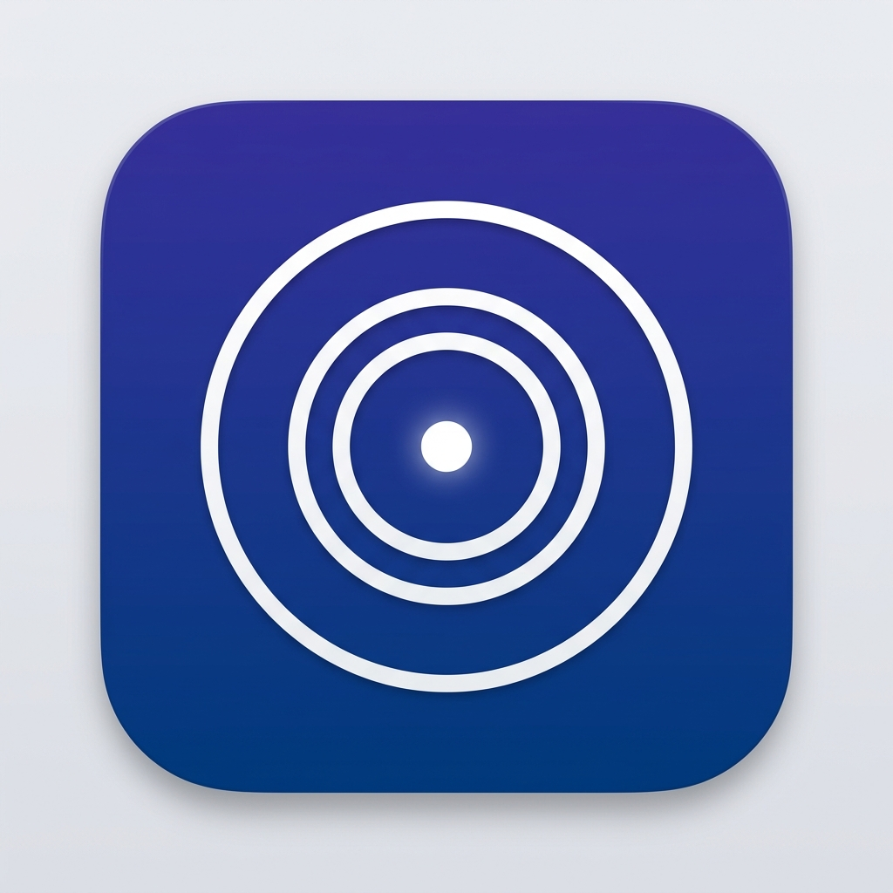

<p align="center">
  
</p>

<h1 align="center">Tunnel</h1>

<p align="center">
  Expose your localhost to your network or the internet — in one click.
</p>

<p align="center">
  
  
  
</p>

---

## What is Tunnel?

Tunnel is a cross-platform desktop app that detects running local dev servers and lets you expose them to your Wi-Fi network or the public internet instantly. No config files, no CLI flags — just click **Expose**.

## Features

- **Auto-detect running apps** — scans for listening ports, filters out system processes on all platforms
- **One-click expose** — click "Expose" to share any local app across your network
- **Public URLs** — toggle internet exposure to get a secure `https` URL anyone can access
- **QR codes** — scan from your phone to open the tunneled app instantly
- **Live metrics dashboard** — real-time stats with sparkline charts:
  - Total Requests, Data Transferred (TX/RX), Avg Latency (with P99)
  - Active Tunnels, Active Connections, Uptime
- **Dark & Light themes** — switch via Settings (Dark / Light / System)
- **Sidebar navigation** — Dashboard, Tunnels, Logs, Settings
- **Cross-platform** — works on macOS, Windows, and Linux with platform-specific system process filtering

## Quick Start

```bash
git clone https://github.com/TharinduWijayarathna/tunnel.git
cd tunnel
npm install
```

**Run as a desktop app:**

```bash
npm run electron:dev
```

**Run as a CLI server (no window):**

```bash
npm start
```

Then open [http://localhost:4040](http://localhost:4040).

## Build

Build a distributable for your platform:

```bash
# macOS (.dmg)
npm run electron:build:mac

# Windows (.exe installer)
npm run electron:build:win

# Linux (AppImage + .deb)
npm run electron:build:linux
```

Output goes to the `dist/` folder.

## How It Works

1. Tunnel scans for listening TCP ports on your machine
2. System processes are filtered out (platform-aware for macOS, Windows, Linux)
3. You pick an app and click **Expose**
4. A reverse proxy maps the port to your local network IP
5. Optionally toggle **Public** to generate an internet-accessible URL
6. Live metrics track requests, data transfer, and latency in real time

## Tech Stack

- **App**: Electron
- **Backend**: Node.js, Express, http-proxy, localtunnel
- **Frontend**: Vanilla HTML, CSS, JavaScript
- **Fonts**: Syne, DM Mono
- **Linting**: ESLint, Prettier

## License

MIT
